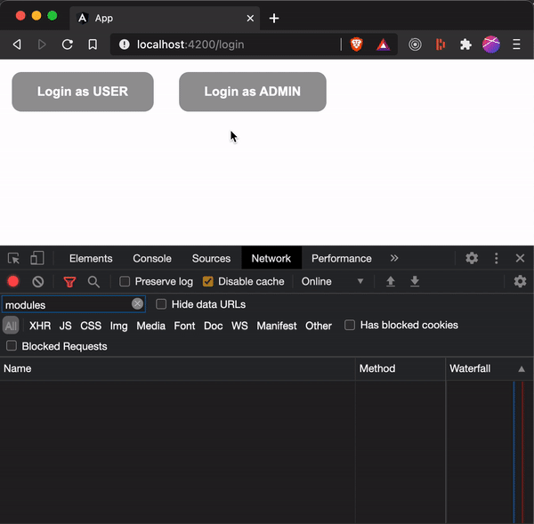

# Lazy Loaded (Angular) Modules for Same Route

## Overview

Occasionally you will get into a scenario where you want the user to land on the same route, but lazy-load a different module based on some conditions like permissions, user role, etc. I created this repo to document the solution I came up with to conditionally lazy-load Angular feature modules for the same route.

## Demo



## Solution

### Step 1

Create a new file that exports an `ReplaySubject<Injector>`.

```javascript
import { Injector } from '@angular/core';
import { ReplaySubject } from 'rxjs';

// Feel free to optimize this implementation if you want to
// expose `Observable<Injector>` instead of the subject itself.
export const appInjector = new ReplaySubject<Injector>();
```

### Step 2

In `main.ts`, get a handle to the root module's `Injector` and publish it to the `appInjector` subject you created above:

```javascript
platformBrowserDynamic()
  .bootstrapModule(AppModule)
  .then((m) => appInjector.next(m.injector)) // publish root module's injector
  .catch((err) => console.error(err));
```

### Step 3

This is the step where we modify the route that needs to asynchronously lazy-load different modules based on some asynchronous condition.

```javascript
const routes: Routes = [
  // other routes
  // ...
  // ...
  // conditional route
  {
    path: "dashboard",
    component: LayoutComponent,
    canActivate: [DashboardAuthGuard], // block this route if user is not logged-in
    loadChildren: () =>
      // Use the appInjector subject
      appInjector.pipe(
        // ...to get a handle to your AuthService
        map((injector) => injector.get(AuthService)),
        // ...then switch to a new observable
        switchMap((authService) => {
          // ...that uses authService to retrieve the logged-in user
          return authService.user$.pipe(
            // ...then switches again, this time to actually lazy-load a feature module
            switchMap((user) => {
              // ...but first let's check the user's role
              switch (user.role) {
                // ...and load Admin Feature Module if user.role is 'admin'
                case "admin":
                  return import(
                    "./modules/admin-dashboard/admin-dashboard.module"
                  ).then((m) => m.AdminDashboardModule);
                // ...or load User Feature Module if user.role is 'user'
                case "user":
                  return import(
                    "./modules/user-dashboard/user-dashboard.module"
                  ).then((m) => m.UserDashboardModule);
              }
            })
          );
        })
      ),
  },
];
```
